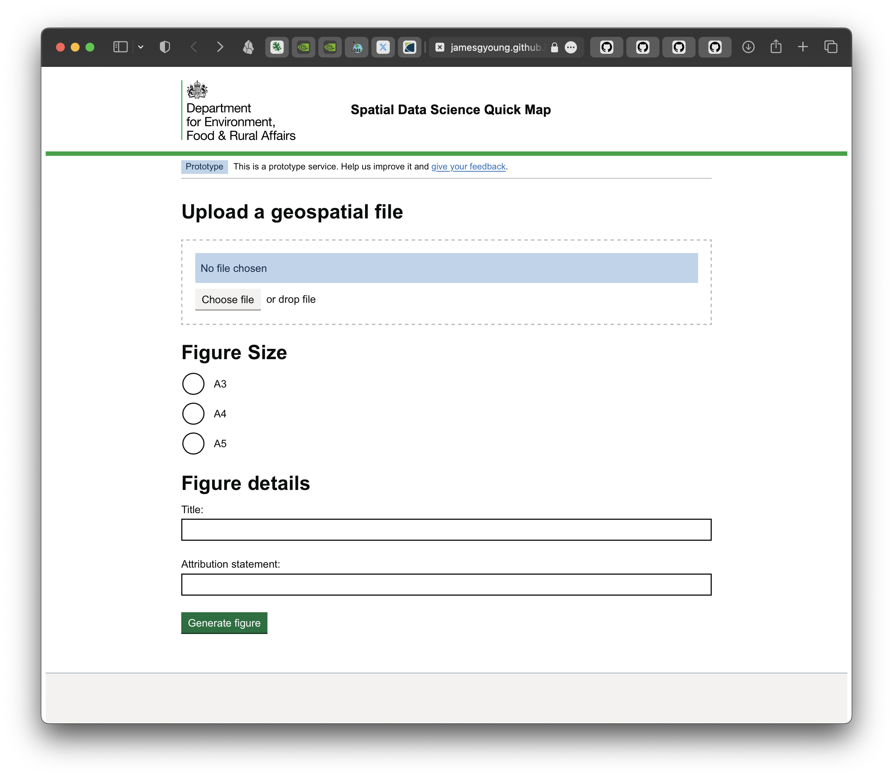
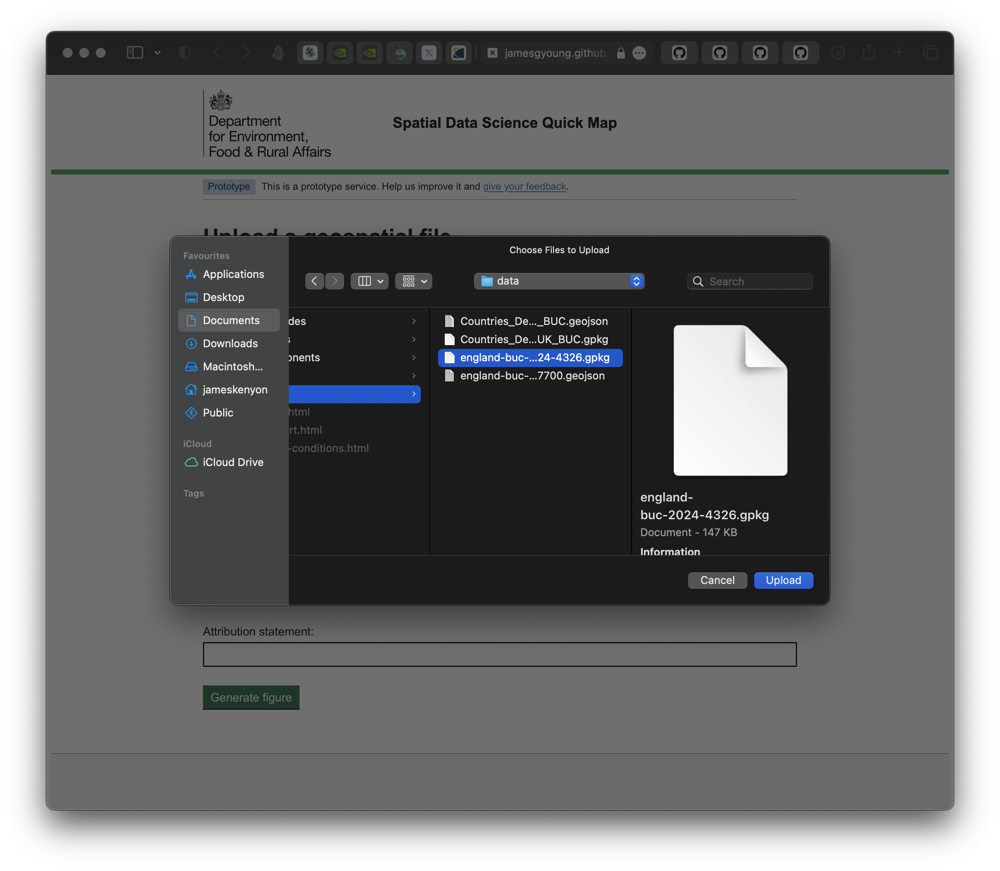
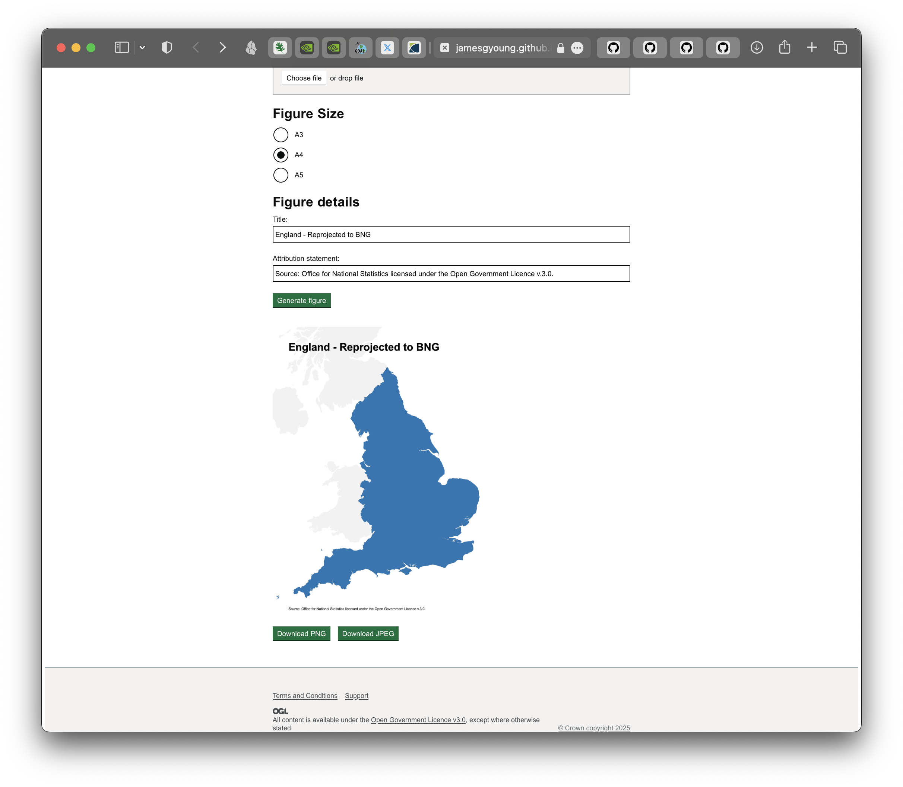
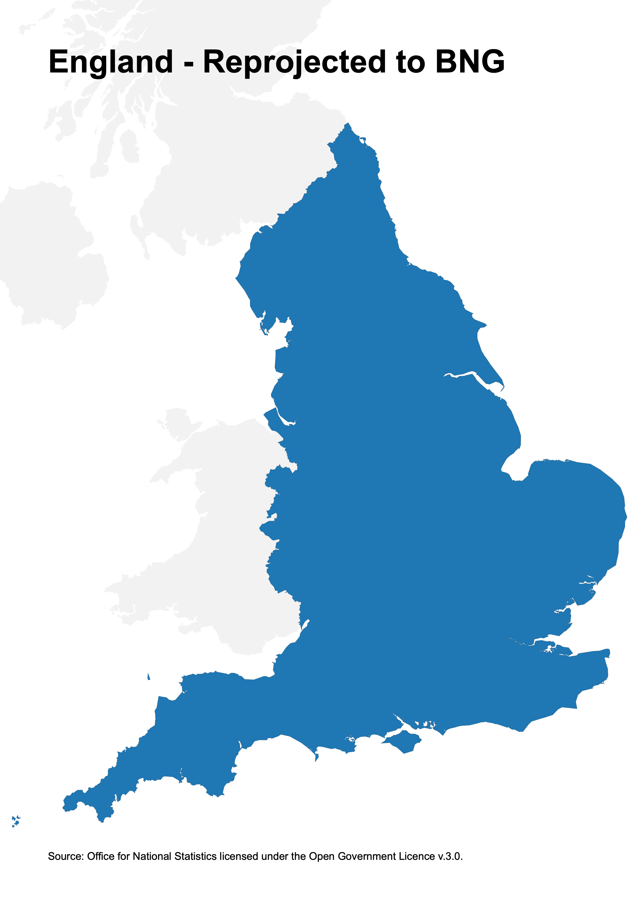
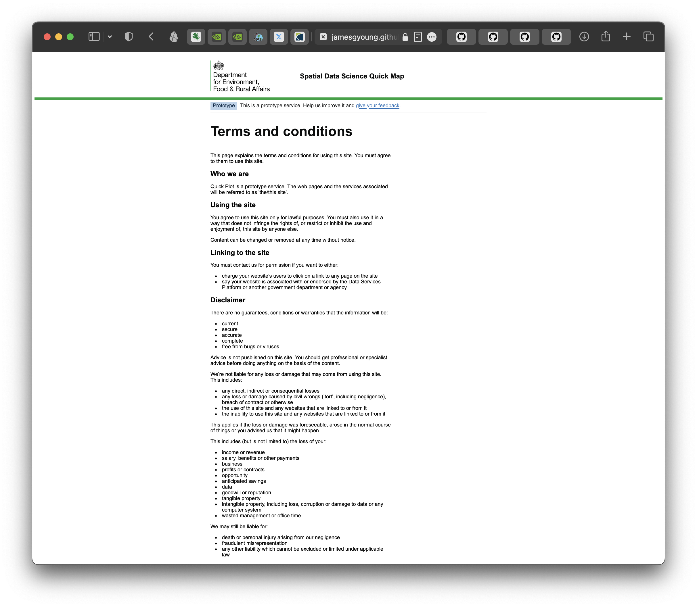

# Quick Map

A Minimum Viable Product (MVP) for creating simple England scoped maps quickly.

- Owner: James Young
- Contact: james.young@defra.gov.uk
- Repository: https://github.com/jamesgyoung/sds-quick-map
- Website: https://jamesgyoung.github.io/sds-quick-map/

### Usage

This service is hosted on [github pages](https://jamesgyoung.github.io/sds-quick-map/). It can also be run locally.

### User Documentation




1. To use the tool, choose or drag and drop a spatial file that is approximately within the scope of England. If you don't have such a file there is a [test file](https://github.com/jamesgyoung/sds-quick-map/blob/master/quickMap/data/england-buc-2024-4326.gpkg) suitable in the repo.



2. Choose a figure size using the radio buttons.
3. Optionally enter a title and attribution statement.
4. Press the 'Generate Figure' button.



5. Click the 'Download PNG' button or 'Download JPEG' button to download the map.



6. To navigate to other pages on the site click 'Terms and conditions' or 'Support' in the footer.




### Build and run locally

[npm](https://docs.npmjs.com/downloading-and-installing-node-js-and-npm) is required to build the project.

1. `git clone https://github.com/jamesgyoung/sds-quick-map.git && cd sds-quick-map`
2. `npm install`
3. `npm start`
4. View the local port that is opened `http://localhost:8080` or an alternate port if in use.
5. To run the tests execute `npm test`.


### Repo Structure

- .github/workflows: Directory to store github actions scripts
- assets/images: Images featured in the README
- quickMap: The code for the application
- \*dist: The build location for the site
- \*node_modules: Installed packages to run the application
- .eleventy.js: Elevnty configuration
- .gitconfig: Local entries not to be included in the upstream repo
- .nojekyll: Skip jekyll during the pages build process
- LICENCE
- README.md
- package-lock.json
- package.json

\* denotes entries that are created during the build process.

---

## Proposal

### Project initiation 

My team (Spatial Data Science) frequently create maps for developing strategy, analysis and publications. Many of these maps are at the England level. We are frequently interacting with new data products and varied sources of data. To get an initial spatial view, we creates maps that simply visualise the geospatial data, to a specific canvas size, along with a title to state what the data product is, and an attribution statement, to ensure the data is correctly attributed, or the provenance logged for posterity. Although a relatively simple exercise, it is not frictionless to start up compute, ensure the data is in the correct location in the cloud, load the data, transform the data, configure the plotting settings, and export the figure. The aim of this project is to build an accessible, easy to use tool that can accomplish this task whilst saving users time and reducing mental load.

Initially this project will only be developed and delivered by the project owner, and as such will receive limited resource to deliver. This project is considered a useful addition but not critical to operations, thus it is not a priority. Delivery, improvements and maintenance will be influenced by this.

### Deliverables

I propose 'Quick Map', a simple browser based tool that can read and transform a geospatial file provided by a user, and plot it to a figure scoped to England. It features the design of a Defra website, common and accessible GOV.UK' User Interface (UI) components and is a static site, allowing it to be hosted and run easily.


## Design

The prototype design for the project was created using Figma.

Access it:
- On figma - [Quick Map design.fig](https://www.figma.com/design/zoiGJ7JmQO1qpvZE5uhpV9/Quick-Map-design)
- Or open the PDF - [Quick Map design.pdf](./assets/images/quick-map-design.pdf)


## Project Management

This project is managed with an Agile methodology using a [Github Projects kanban board](https://github.com/users/jamesgyoung/projects/1). This methodology is being used as the project has a short (although non-specific) delivery timeframe and the software code will developed in an iterative fashion, requiring constant reevaluation to deliver the proposed design. The project will recieve feedback from stakeholders at the sprint review meeting, at the end of the first 1 week sprint, where the initial MVP and (undefined) feature-set will be showcased. It will then undergo further development in subsequent sprints powered by the regular feedback.

### Requirements

The project requirements have been documented and broken down into tickets that have been created as ['issues'](https://github.com/jamesgyoung/sds-quick-map/issues). The ticket names are prepended using [these conventions](https://geopandas.org/en/latest/community/contributing.html#commit-message-conventions) to identify their purpose in the project. The issues on the repo are featured on the project board.

### Task list

The full task list is defined in the issue [Quick Map MVP #20](https://github.com/jamesgyoung/sds-quick-map/issues/20), that also categorises the tickets by the requisite phases of the project: 'Phase 1 - Initialise repo', ' Phase 2 - Design MVP' etc.

### Schedule

Sprint 1 will completed over the course of a week. All tickets on the project board currently belong to sprint 1. As the project is being managed in an agile fashion certain tasks might have to be delayed to subsequent sprints.

The tickets are labelled with task size, ranging from 'XS' (extra-small) to 'XL' (extra-large), to give an indication of the approximate time allocation for each task. They are also labelled with the phase they should be executed in. This allows for the tickets to be easily filtered by their phase to understand what's in focus for delivery of each phase.


### Project Board

The project board is the core project management tool for understanding the current state of tasks and the project as a whole. It features four sections.

- Backlog: The tasks for the project
- In progress: Tasks currently in progress
- In review: Tasks where work needs to be checked before decreeing it has been finished
- Done: An archive of the completed tasks that have been reviewed


### Code management

Tasks are worked on from distinct branches. Branches are named using the convention `issue-{issue-number}`. When a task is completed a pull request can be opened that can merge a task-branch into the master project branch.

### Risk Register

Technologically there are no major risks that should cause project delays. The intended components and software to be used to deliver the project are mature and well documented. Potentially, software not considered may have to be adopted as a function of the agile methodology, which could necessitate the use of tools or code that may not have been vetted or could have cost not budgeted for. Other risks include necessary online services such as Figma and GitHub experiencing downtime, limiting one's ability to accomplish tasks.

The biggest risks are related to the time projections for executing the project. The assessment for how long each task will take is estimated using a best guess, based on knowledge and previous experience. These time estimates could easily be overrun, causing delays or resulting in missing functionality in the MVP.

---

## MVP prototype

The project was built incrementally, starting with the initialisation of npm, then creating html components like the header and footer featured on the site, followed by the creation of the main.scss file to style these components. I then proceeded to add the additional UI components like the buttons and figure canvas, added additional pages on the site (Terms and conditions & Support), then implemented the core functionality, utilising test driven development to authenticate my javascript worked as intended. I finished by deploying the site to GitHub pages and documenting the project. 


---


# Technical Documentation
## 1. Architecture

### System Components

The application is built using a modern static site generator architecture with client-side geospatial processing:

- **Eleventy (11ty)** - Static site generator handling build process and templating
- **GDAL3.js** - WebAssembly-compiled GDAL for client-side geospatial file processing
- **D3.js** - SVG/Canvas rendering for map visualisation
- **GitHub Pages** - Static hosting with automated deployment
- **Jest** - Testing framework with ES module support

### Data Flow

```
User uploads file → File validation → GDAL processing → CRS detection/reprojection → 
Geometry calculations → D3 projection setup → Canvas rendering → Download generation
```

### Design Decisions

- **Client-side processing** - All geospatial operations occur in the browser, eliminating the need for a server
- **Modular architecture** - Core logic separated into testable modules


## 2. Technical Components

### File Processing Pipeline (fileHandler.js)

Handles upload validation and geospatial file processing:

```javascript
isFileTypeSupported(filename) // Validates file extensions
needsReprojection(geoJson)    // Checks CRS requirements  
processGeospatialFile(gdal, file) // Main processing function
```

**Supported formats**: GeoPackage (.gpkg), Shapefile (.shp), GeoJSON (.geojson/.json), KML (.kml)

**Processing logic**:
1. File type validation
2. Direct parsing for GeoJSON files
3. GDAL conversion to GeoJSON for other formats
4. CRS detection and conditional reprojection to EPSG:27700

### Geometry Calculations (geometryUtils.js)

Core geometric operations for map projection:

```javascript
calculateBounds(geoJsonFeature) // Computes feature extents
createBoundingBox(bounds, buffer) // Generates buffered bounds
```

**Key functions**:
- Recursive coordinate processing for complex geometries
- Bounding box generation with configurable buffer
- Support for Polygon, MultiPolygon, LineString, and Point geometries

### Coordinate System Handling

**Input**: Any CRS supported by GDAL (automatic detection)
**Output**: British National Grid (EPSG:27700) - mandatory for consistency
**Detection**: Examines GeoJSON CRS properties to determine reprojection needs

The system assumes WGS84 (EPSG:4326) for files without explicit CRS information.

### Canvas Rendering

**D3.js integration**:
- Identity projection with Y-axis reflection for BNG coordinates
- Fixed viewport bounds based on England boundary with 33km buffer  
- Multi-layer rendering: UK countries → England boundary → user data
- Scalable output at 300 DPI for print quality

**Rendering pipeline**:
1. Canvas setup with paper dimensions (A3/A4/A5)
2. D3 projection configuration
3. Sequential layer drawing
4. Text overlay (title/attribution)

## 3. Build & Deployment

### Eleventy Configuration

Key configuration in `.eleventy.js`:

```javascript
// Input/output directories
dir: { input: "quickMap", output: "dist" }

// GitHub Pages path handling
pathPrefix: "/sds-quick-map/"

// HTML transforms for production links
addTransform("fixPaths", ...)
```

### Deployment Pipeline

**GitHub Actions workflow**:
1. Install dependencies (`npm ci`)
2. Run tests (`npm test`)
3. Build site (`NODE_ENV=production npm run build`)
4. Deploy to `gh-pages` branch

---

# Project Evaluation

## Overview

This project aimed to create a browser-based tool for generating static maps with uploaded geospatial data overlaid on England boundaries. The final application allows users to upload various spatial file formats and produce high-quality maps suitable for reports and presentations. The development process followed modern web development practices with automated testing and continuous deployment.

## Technical Implementation

### Architecture Decisions

I chose a client-side processing approach using WebAssembly (GDAL3.js) rather than building a traditional server-based solution. This decision was driven primarily by simplicity - avoiding server infrastructure, databases, and hosting costs. In practice, this worked well for the intended use case, though it does limit the tool to processing smaller datasets that can be handled in browser memory.

The modular code structure emerged from adopting Test-Driven Development practices. Initially, I had everything in a single large class, but extracting functions for file handling and geometry calculations made testing much more manageable. This refactoring also made the code easier to debug when issues arose.

### Geospatial Processing

Getting the coordinate reference system handling right took longer than expected. The automatic detection of whether reprojection is needed prevents unnecessary processing but required careful testing with files in different projections. I settled on British National Grid (EPSG:27700) as the fixed output because it's appropriate for England-focused mapping and avoids projection distortion issues.

Supporting multiple file formats through GDAL was straightforward once the GDAL3.js WebAssembly compilation was understood. The WebAssembly approach provides access to the full GDAL functionality within the browser environment, which simplified the file processing pipeline implementation considerably.

### Rendering and Visualisation

D3.js was selected for map rendering due to its robust coordinate transformation capabilities and mature ecosystem for data visualisation. The library handles the mathematical complexities of projection transformation elegantly whilst providing fine-grained control over the rendering process. The fixed England viewport approach simplifies the user experience by eliminating the need for users to configure map extents or zoom levels, though this design choice means that data covering other parts of the UK may not display optimally.

The paper size options (A3, A4, A5) at 300 DPI were included to meet real-world usage requirements. Having worked with printed maps before, I know that web-optimised images often don't translate well to print media.

## Development Process

### Testing Approach

Implementing TDD was initially challenging as it required restructuring the code into testable units. The approach proved valuable, with focused tests on core business logic (file validation, coordinate calculations) providing confidence during development iterations. The Jest framework with ES module support enabled comprehensive testing of the geospatial processing functions despite their complexity.

### Deployment and CI/CD

The project utilises GitHub Actions for automated testing and deployment, creating a robust development pipeline that ensures code quality and prevents regressions. The continuous deployment approach allows for rapid iteration whilst maintaining stable releases.

## Reflection on Implementation

The coordinate system handling required substantial research to ensure accurate spatial data processing. Understanding when and how to reproject spatial data correctly was crucial, as errors in this area would produce incorrect map outputs. Testing with files in different projections was essential to validate the automatic detection functionality.

The modular architecture that emerged from TDD practices proved beneficial for both testing and code maintainability. Separating concerns into discrete modules (file handling, geometry calculations, rendering) made the codebase more comprehensible and enabled focused testing of individual components.

## Future Improvements

With more time, I would add progress indicators for file processing, as larger files can take several seconds to process with no visual feedback. Better error messaging would also improve the user experience - currently, users might not understand why their file wasn't accepted.

Additional cartographic elements like scale bars and north arrows would make the maps more professional, though this would require additional development effort for relatively marginal benefit.

## Conclusion

The project successfully delivers its core functionality despite the deployment complexities encountered. The final tool produces quality map outputs and handles the intended file formats reliably. Whilst some technical solutions feel less elegant than originally envisioned (particularly the path handling), they work effectively in practice. The development process highlighted the value of automated testing and the importance of considering deployment constraints early in the design phase.

