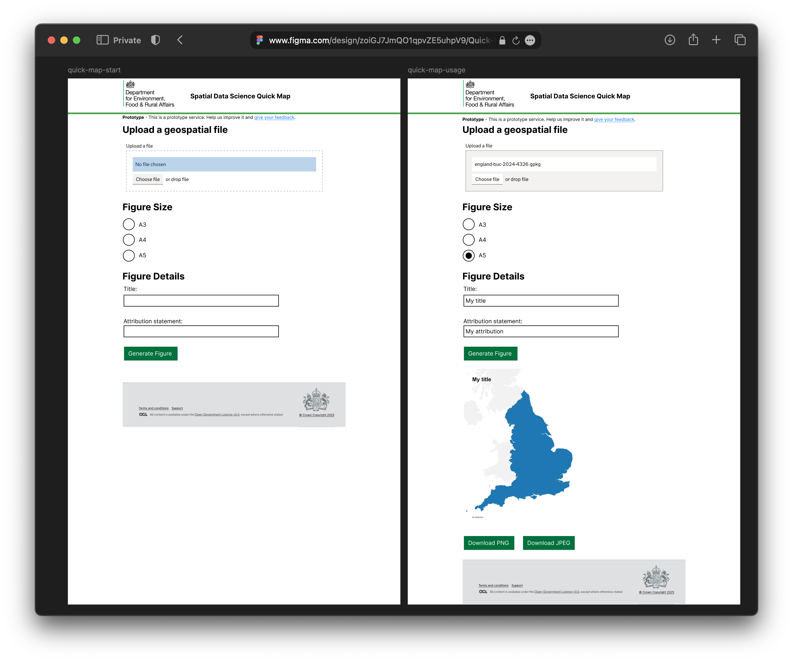
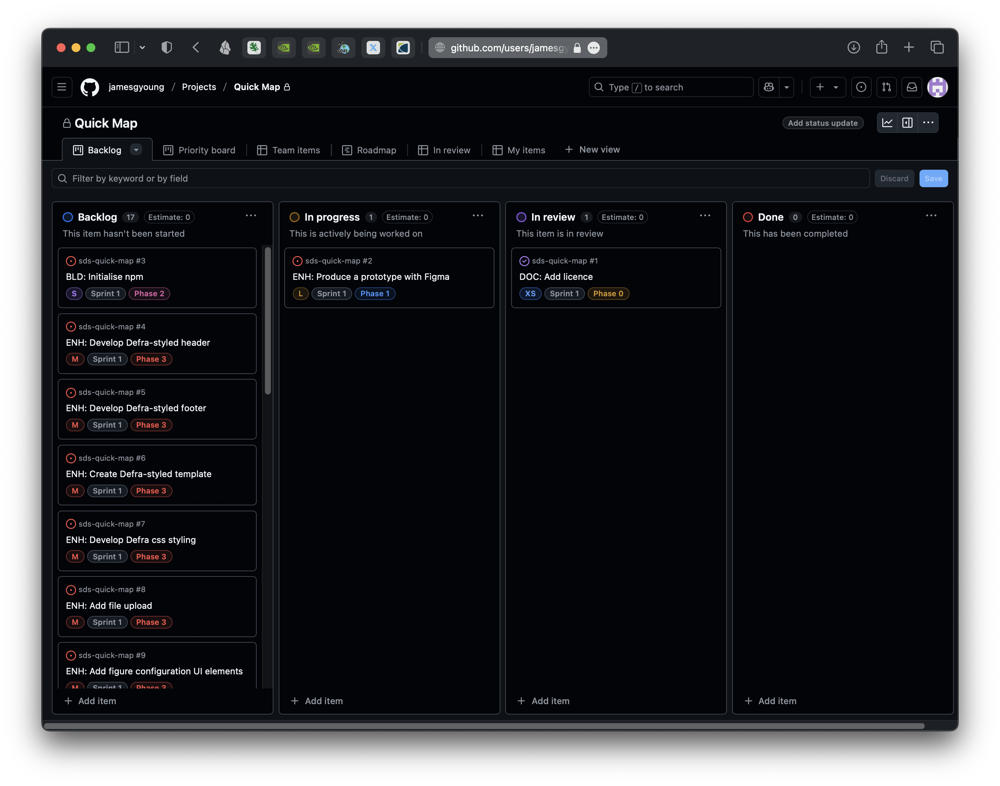

# Quick Map

A Minimum Viable Product (MVP) for creating simple England scoped maps quickly.

- Owner: James Young
- Contact: james.young@defra.gov.uk

### Usage

### Repo Structure

---

## Proposal

### Project initiation 

My team (Spatial Data Science) frequently create maps for developing strategy, analysis and publications. Many of these maps are at the England level. We are frequently interacting with new data products and varied sources of data. To get an initial spatial view, we creates maps that simply visualise the geospatial data, to a specific canvas size, along with a title to state what the data product is, and an attribution statement, to ensure the data is correctly attributed, or the provenance logged for posterity. Although a relatively simple exercise, it is not frictionless to start up compute, ensure the data is in the correct location in the cloud, load the data, transform the data, configure the plotting settings, and export the figure. The aim of this project is to build an accessible, easy to use tool that can accomplish this task whilst saving users time and reducing mental load.

Initially this project will only be developed and delivered by the project owner, and as such will receive limited resource to deliver. This project is considered a useful addition but not critical to operations, thus it is not a priority. Delivery, improvements and maintenance will be influenced by this.

### Deliverables

I propose 'Quick Map', a simple browser based tool that can read and transform a geospatial file provided by a user, and plot it to a figure scoped to England. It features the design of a Defra website, common and accessible GOV.UK' User Interface (UI) components and is a static site, allowing it to be hosted and run easily.

## Design

The prototype design for the project was created using Figma.

Access it:
- On figma - [Quick Map design.fig](https://www.figma.com/design/zoiGJ7JmQO1qpvZE5uhpV9/Quick-Map-design)
- Or open the PDF - [Quick Map design.pdf](./assets/images/quick-map-design.pdf)

## Project Management

This project is managed with an Agile methodology using a [Github Projects kanban board](https://github.com/users/jamesgyoung/projects/1). This methodology is being used as the project has a short (although non-specific) delivery timeframe and the software code will developed in an iterative fashion, requiring constant reevaluation to deliver the proposed design. The project will recieve feedback from stakeholders at the sprint review meeting, at the end of the first 1 week sprint, where the initial MVP and (undefined) feature-set will be showcased. It will then undergo further development in subsequent sprints powered by the regular feedback.

### Requirements

The project requirements have been documented and broken down into tickets that have been created as ['issues'](https://github.com/jamesgyoung/sds-quick-map/issues). The ticket names are prepended using [these conventions](https://geopandas.org/en/latest/community/contributing.html#commit-message-conventions) to identify their purpose in the project. The issues on the repo are featured on the project board.

### Task list

The full task list is defined in the issue [Quick Map MVP #20](https://github.com/jamesgyoung/sds-quick-map/issues/20), that also categorises the tickets by the requisite phases of the project: 'Phase 1 - Initialise repo', ' Phase 2 - Design MVP' etc.

### Schedule

Sprint 1 will completed over the course of a week. All tickets on the project board currently belong to sprint 1. As the project is being managed in an agile fashion certain tasks might have to be delayed to subsequent sprints.

The tickets are labelled with task size, ranging from 'XS' (extra-small) to 'XL' (extra-large), to give an indication of the approximate time allocation for each task. They are also labelled with the phase they should be executed in. This allows for the tickets to be easily filtered by their phase to understand what's in focus for delivery of each phase.

### Project Board

The project board is the core project management tool for understanding the current state of tasks and the project as a whole. It features four sections.

- Backlog: The tasks for the project
- In progress: Tasks currently in progress
- In review: Tasks where work needs to be checked before decreeing it has been finished
- Done: An archive of the completed tasks that have been reviewed

### Risk Register

Technologically there are no major risks that should cause project delays. The intended components and software to be used to deliver the project are mature and well documented. Potentially, software not considered may have to be adopted as a function of the agile methodology, which could necessitate the use of tools or code that may not have been vetted or could have cost not budgeted for. Other risks include necessary online services such as Figma and GitHub experiencing downtime, limiting one's ability to accomplish tasks.

The biggest risks are related to the time projections for executing the project. The assessment for how long each task will take is estimated using a best guess, based on knowledge and previous experience. These time estimates could easily be overrun, causing delays or resulting in missing functionality in the MVP.

---

## MVP prototype

---

## Documentation

### User Documentation

### Technical Documentation

---

## Evaluation